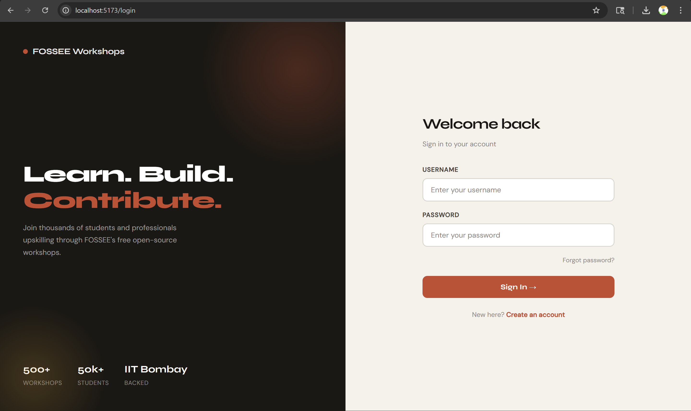
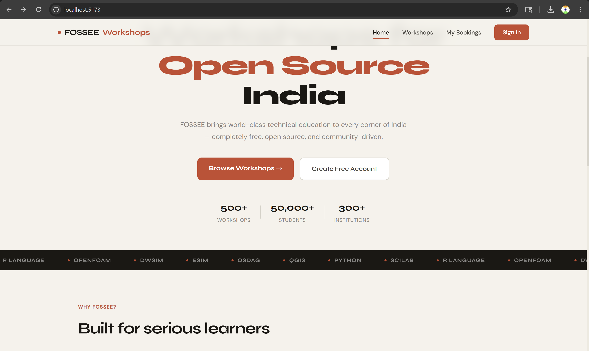
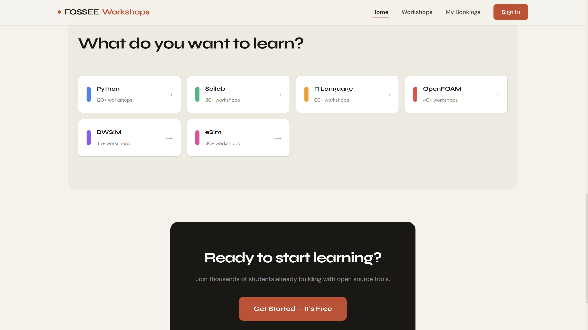
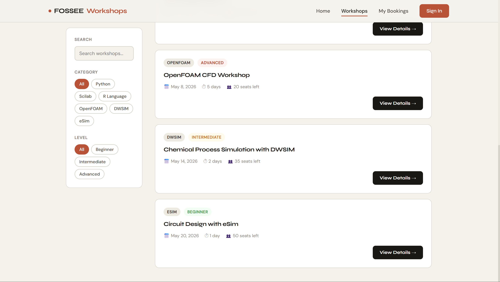
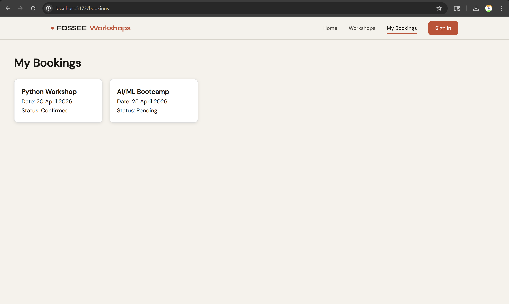

# 🔬 FOSSEE Workshop Portal — UI/UX Redesign

**Fellowship Task | FOSSEE, IIT Bombay**  
**Submitted by:** Nirmal Kalbande  

---

## 🪪 Project Identity

| Field              | Detail |
|--------------------|--------|
| Project Title      | FOSSEE Workshop Portal — UI/UX Redesign |
| Student Name       | **Nirmal Kalbande** |
| Institution        | Pimpri Chinchwad University |
| Program            | B.Tech — Computer Science Engineering |
| Fellowship         | FOSSEE Fellowship — IIT Bombay |
| Task Type          | Portal Redesign Task |
| Primary Stack      | React (Vite) + Django |

---

## 🎯 Overview

This project focuses on redesigning the FOSSEE Workshop Portal to improve the overall user experience and interface.

The main goal was to make the portal more **clean, responsive, and user-friendly**, while keeping the functionality simple and easy to use.

---

## 🎨 Design Improvements

- Improved layout structure for better readability  
- Added card-based UI for workshops  
- Fixed alignment and spacing issues  
- Created a clean and simple navigation bar  
- Enhanced overall visual hierarchy  

---

## 📱 Responsiveness

The UI was designed to work across different devices:

- Used Flexbox and Grid for layout  
- Applied responsive styling using CSS  
- Tested on mobile, tablet, and desktop screens  

---

## ⚖️ Design vs Performance

- Avoided heavy animations to keep UI smooth  
- Used simple CSS instead of heavy libraries  
- Focused on fast loading and clean design  

---

## 🧠 Challenges Faced

The main challenge was making the UI responsive and properly aligned.

- Faced layout issues on smaller screens  
- Fixed using Flexbox and proper spacing  
- Tested multiple times to ensure consistency  

---

## 🖼️ Visual Journey — Before & After

### 🔴 Before


---

### 🟢 After

  
  
  
  


---

## 🚀 Setup Requirements

### 📌 Prerequisites

- Python (>= 3.8)  
- Node.js (>= 16)  
- npm  
- Git  

---

## ⚙️ Installation & Setup

### 1. Clone Repository
```bash
git clone https://github.com/Nirmal-Kalbande/workshop-booking-system.git
cd workshop-booking-system

2. Backend Setup (Django)
python -m venv venv
venv\Scripts\activate
pip install -r requirements.txt
python manage.py migrate
python manage.py runserver


3. Frontend Setup (React)
cd frontend
npm install
npm run dev

🌐 Running the Project
Backend: http://127.0.0.1:8000
Frontend: http://localhost:5173


📌 Notes
Start backend before frontend
Make sure all dependencies are installed
Use a modern browser for best experience